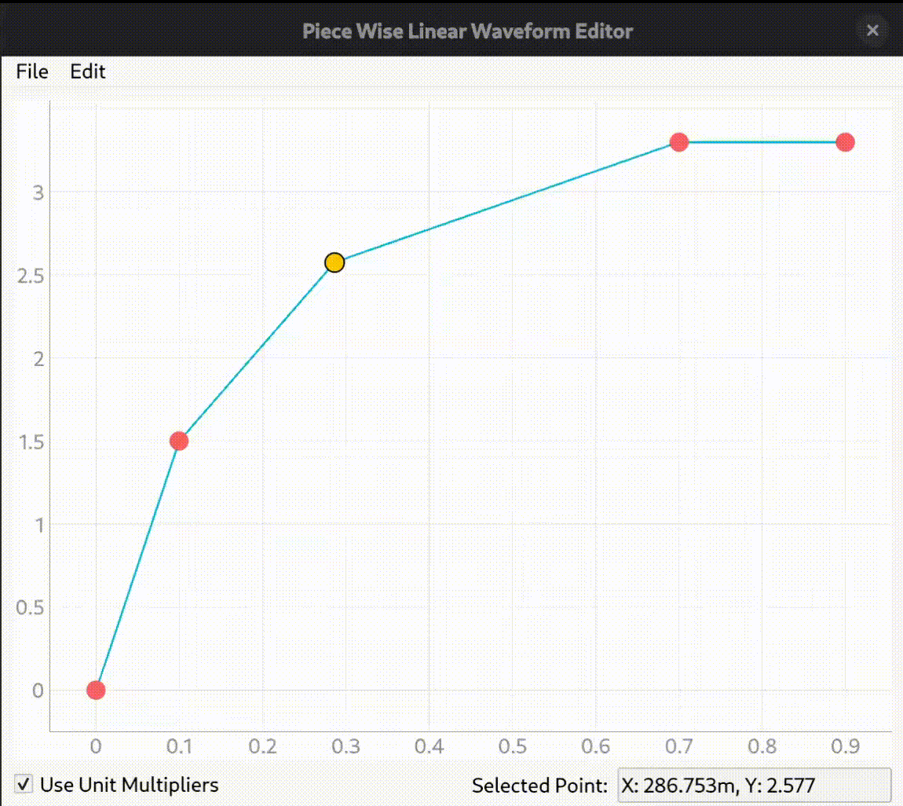

# Piece Wise Linear Waveform Editor

A simple GUI waveform editor for creating piece wise linear (PWL) waveforms for SPICE simulations.

The points on the PWL waveform can be dragged around or moved to specified coordinates.
The waveform can be saved in a CSV file.
SPICE unit multiplier prefix is supported.

## Setup from source code

Clone the repository.
```
git clone https://github.com/light655/pwl_waveform_editor.git
```

Install the required packages.
```
pip3 install PySide6 pyqtgraph
```

Run the program.
```
python3 main.py
```

## Usage



### Hotkeys

- A - Add new point: type the coordinates of the new point.
- D - Remove selected point.
- M - Move selected point: type the coordinates of the new position of the point.

SPICE unit multiplier is supported when typing in the coordinates.

### Mouse

- Click on a point to select the point.
- Drag a point to move the point.
- Scroll to zoom in and out.
- Drag the canvas to move the canvas.